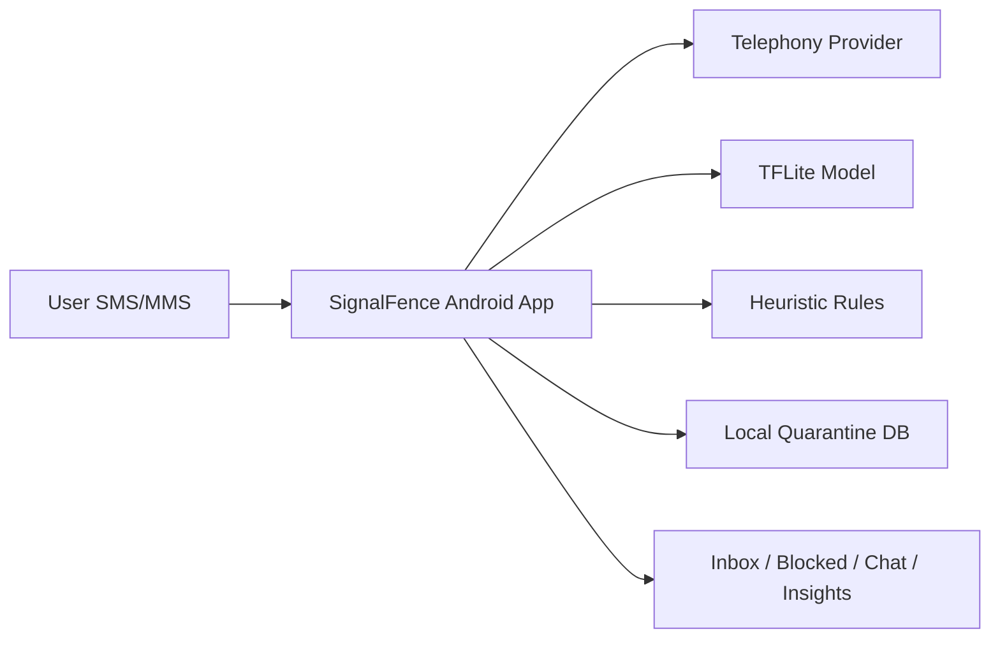

<div align="center">
  

  <h1>SignalFence</h1>

  <p>AI-powered Android SMS firewall with on-device ML to detect spam and phishing in real time.</p>

  <p>
    
    
    
    
    
    <a href="LICENSE"></a>
  </p>

  <p><strong>Built by Shashank Preetham Pendyala</strong></p>
</div>

---

## Overview

SignalFence is a privacy-first SMS firewall that runs fully on-device. It becomes the default SMS app, scores every message using a local TFLite model plus heuristic rules, and cleanly separates Inbox vs Blocked. It also quarantines risky threads, provides search and insights, and improves accuracy via user feedback signals.

---

## Table of Contents

- [Why It Matters](#why-it-matters)
- [Key Features](#key-features)
- [AI/ML Pipeline](#aiml-pipeline)
- [Architecture](#architecture)
- [Tech Stack](#tech-stack)
- [Project Structure](#project-structure)
- [Getting Started](#getting-started)
- [Run, Build, Test](#run-build-test)
- [Configuration](#configuration)
- [Security Notes](#security-notes)
- [Troubleshooting](#troubleshooting)
- [License](#license)

---

## Why It Matters

- SMS phishing and scam campaigns are fast, cheap, and constantly evolving.
- Most apps require cloud scanning, which creates privacy risk and latency.
- SignalFence keeps detection on-device and offline, prioritizing privacy.

---

## Key Features

| Capability | Description |
| --- | --- |
| Default SMS app | Intercepts SMS/MMS for real-time scoring and blocking. |
| Inbox vs Blocked | Clean separation with quarantined spam threads. |
| On-device AI | TFLite model + heuristics for risk scoring. |
| Adaptive feedback | Mark spam/safe to refine future scoring. |
| Insights | Safety score, totals, and threat counts. |
| Privacy-first | No cloud sync, fully offline operation. |

---

## AI/ML Pipeline

- **Local ML Model**: Uses a TFLite classifier for message risk prediction.
- **Heuristic Layer**: Adds rule-based signals (links, UPI handles, OTP traps, phishing keywords).
- **Calibration**: Applies score calibration to stabilize predictions.
- **Fusion**: Combines ML probability and heuristic score into a single risk label.
- **Feedback Loop**: User actions (mark spam/trusted) adjust future results and filtering.

---

## Architecture



---

## Tech Stack

- Mobile: Android (Kotlin), Gradle
- AI/ML: TensorFlow Lite
- UI: Material 3
- Storage: Local SQLite (quarantine)

---

## Project Structure

```text
.
|-- app/                          # Android client (Gradle)
|   |-- src/main/
|   |   |-- AndroidManifest.xml
|   |   |-- java/com/signalfence/app/
|   |   |-- res/
|   |   |-- assets/               # Tokenizer + model assets
|   |-- build.gradle.kts
|-- build.gradle.kts
|-- settings.gradle.kts
|-- gradle.properties
|-- README.md
```

---

## Getting Started

### Prerequisites

- Android Studio (recent stable)
- JDK 11+

### Setup

```bash
git clone <REPO_URL>
cd signalfence-ai-android
```

Open in Android Studio and let Gradle sync.

---

## Run, Build, Test

```bash
./gradlew :app:assembleDebug
./gradlew :app:installDebug
./gradlew test
```

---

## Configuration

- No backend configuration required.
- All detection runs locally using assets in `app/src/main/assets/`.

---

## Security Notes

- No cloud sync or external API calls.
- SMS permissions are required to function as the default SMS app.
- Do not commit keystores or signing secrets.

---

## Troubleshooting

- Build issues: ensure JDK 11+ and run `./gradlew clean`.
- Permissions issues: set SignalFence as Default SMS app in Android Settings.
- No messages: verify SMS permissions and device SMS support.

---

## License

MIT License. See [LICENSE](LICENSE).
